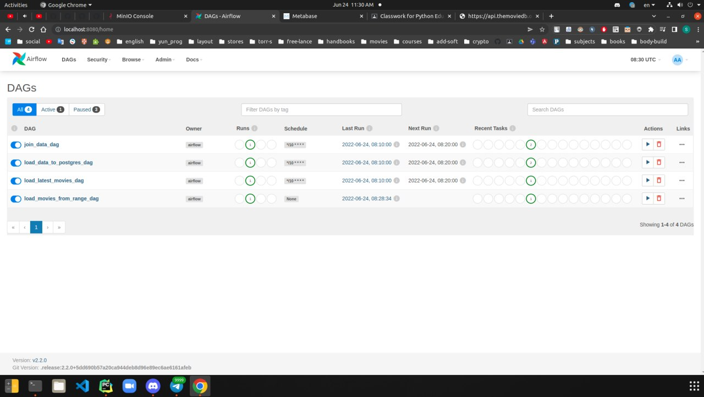
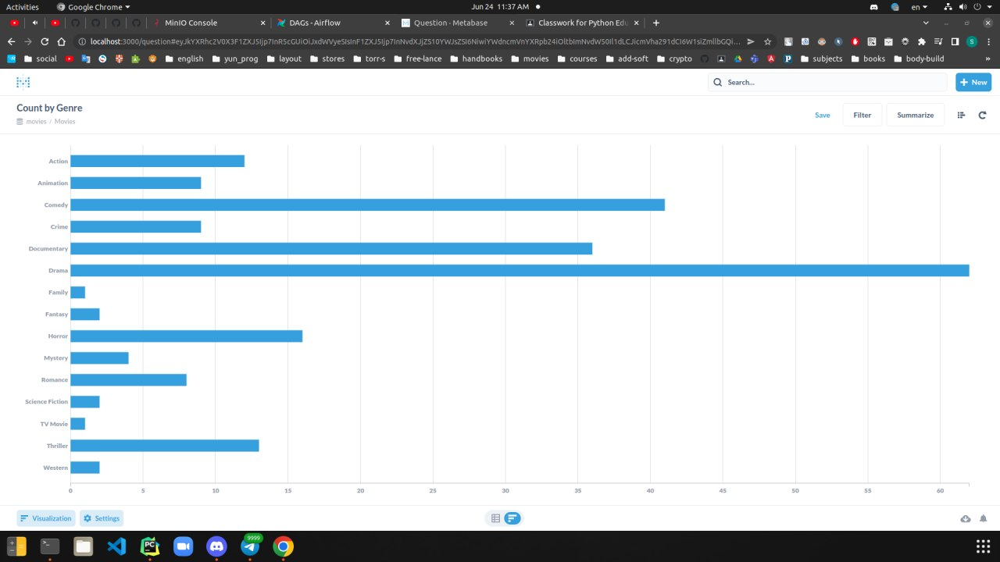
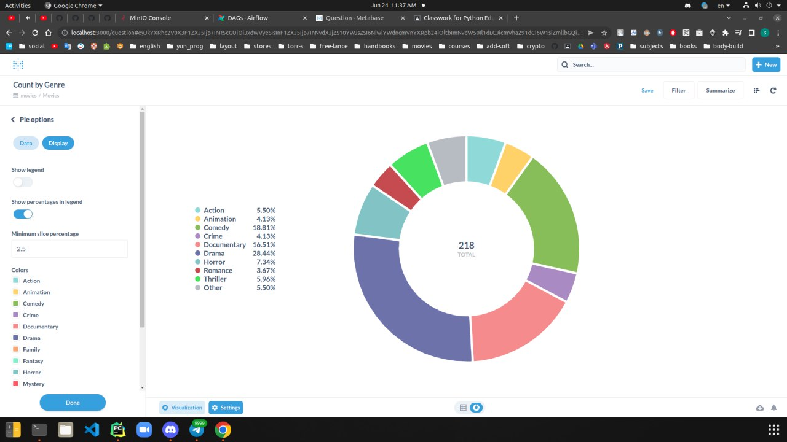

# PROJECT REPORT

## About project
The main goal of this project is to keep movie data from 2 source for future processing,
and to show some charts with stored movies.

## Main components
- s3 - to save row movie data
- postgres - to save processed data
- metabase - to show dashboards
- airflow - to schedule tasks

## Usage

To get started with the code examples, start Airflow with Docker Compose with the following command:

```bash
docker-compose up -d
```

- The webserver initializes a few things, so wait for a few seconds, and you should be able to access the
Airflow webserver at http://localhost:8080.

To stop running the examples, run the following command:

```bash
docker-compose down -v
```

## Airflow dags



## Metabase diagram




# Metabase pie chart


