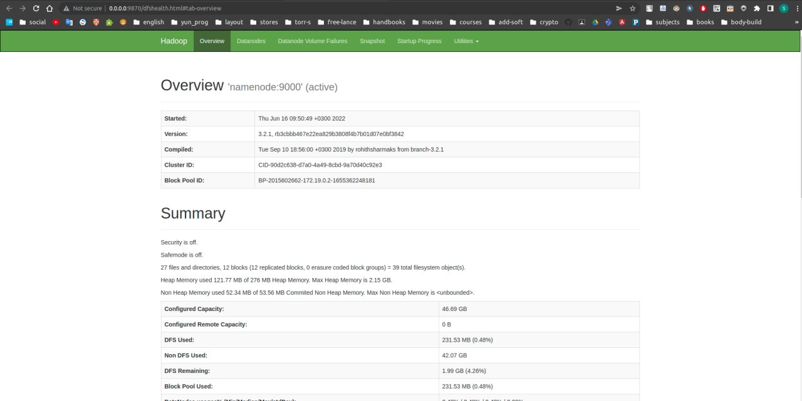
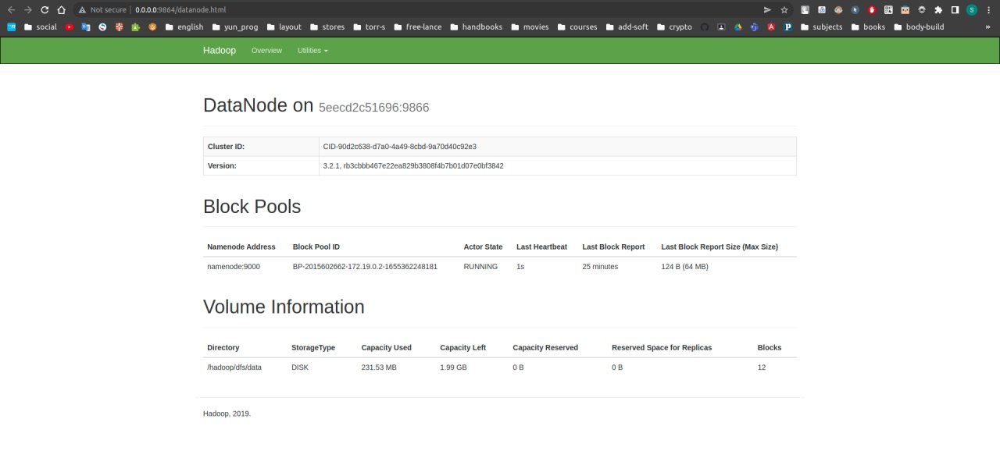
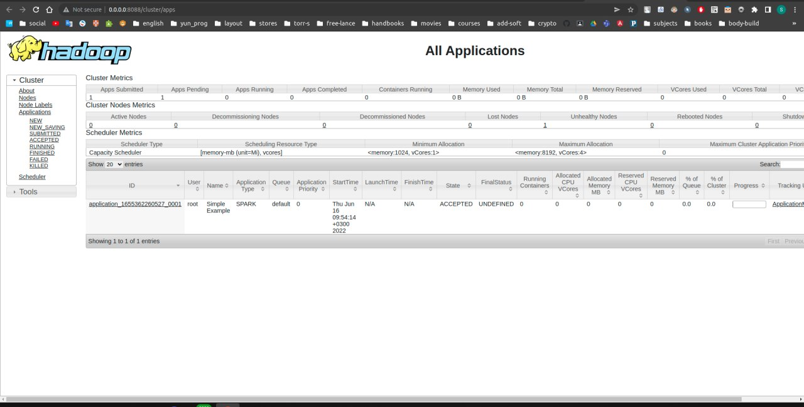
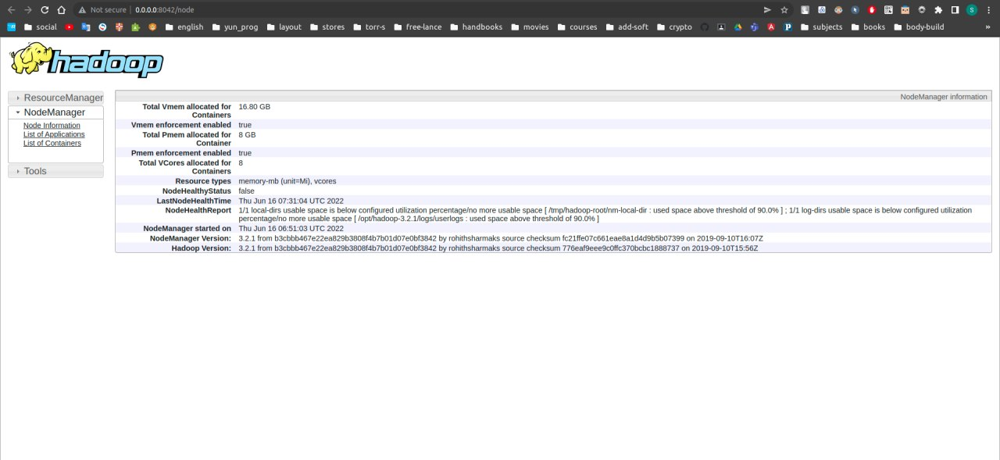

# HADOOP TASK

### NameNode

### DataNode

### ResourceManager

### NodeManager

### Logs (Something went wrong, process doesn't finish, it freezes with ACCEPTED state and all...)
(vevn) sergey@sergey-ms-7917:~/Documents/python-education/de/hadoop$ sudo docker run --rm --network hadoop_default simple_example
22/06/16 06:53:59 WARN NativeCodeLoader: Unable to load native-hadoop library for your platform... using builtin-java classes where applicable
Using Spark's default log4j profile: org/apache/spark/log4j-defaults.properties
22/06/16 06:53:59 INFO SparkContext: Running Spark version 3.1.1
22/06/16 06:54:00 INFO ResourceUtils: ==============================================================
22/06/16 06:54:00 INFO ResourceUtils: No custom resources configured for spark.driver.
22/06/16 06:54:00 INFO ResourceUtils: ==============================================================
22/06/16 06:54:00 INFO SparkContext: Submitted application: Simple Example
22/06/16 06:54:00 INFO ResourceProfile: Default ResourceProfile created, executor resources: Map(cores -> name: cores, amount: 1, script: , vendor: , memory -> name: memory, amount: 1024, script: , vendor: , offHeap -> name: offHeap, amount: 0, script: , vendor: ), task resources: Map(cpus -> name: cpus, amount: 1.0)
22/06/16 06:54:00 INFO ResourceProfile: Limiting resource is cpus at 1 tasks per executor
22/06/16 06:54:00 INFO ResourceProfileManager: Added ResourceProfile id: 0
22/06/16 06:54:00 INFO SecurityManager: Changing view acls to: root
22/06/16 06:54:00 INFO SecurityManager: Changing modify acls to: root
22/06/16 06:54:00 INFO SecurityManager: Changing view acls groups to: 
22/06/16 06:54:00 INFO SecurityManager: Changing modify acls groups to: 
22/06/16 06:54:00 INFO SecurityManager: SecurityManager: authentication disabled; ui acls disabled; users  with view permissions: Set(root); groups with view permissions: Set(); users  with modify permissions: Set(root); groups with modify permissions: Set()
22/06/16 06:54:00 INFO Utils: Successfully started service 'sparkDriver' on port 37459.
22/06/16 06:54:00 INFO SparkEnv: Registering MapOutputTracker
22/06/16 06:54:00 INFO SparkEnv: Registering BlockManagerMaster
22/06/16 06:54:00 INFO BlockManagerMasterEndpoint: Using org.apache.spark.storage.DefaultTopologyMapper for getting topology information
22/06/16 06:54:00 INFO BlockManagerMasterEndpoint: BlockManagerMasterEndpoint up
22/06/16 06:54:00 INFO SparkEnv: Registering BlockManagerMasterHeartbeat
22/06/16 06:54:00 INFO DiskBlockManager: Created local directory at /tmp/blockmgr-83dbe2bc-eb21-4d9d-8cae-687cfab3adb4
22/06/16 06:54:00 INFO MemoryStore: MemoryStore started with capacity 366.3 MiB
22/06/16 06:54:00 INFO SparkEnv: Registering OutputCommitCoordinator
22/06/16 06:54:00 INFO Utils: Successfully started service 'SparkUI' on port 4040.
22/06/16 06:54:00 INFO SparkUI: Bound SparkUI to 0.0.0.0, and started at http://9604fb4dbb55:4040
22/06/16 06:54:01 INFO RMProxy: Connecting to ResourceManager at resourcemanager/172.19.0.4:8032
22/06/16 06:54:01 INFO Client: Requesting a new application from cluster with 1 NodeManagers
22/06/16 06:54:02 INFO Configuration: resource-types.xml not found
22/06/16 06:54:02 INFO ResourceUtils: Unable to find 'resource-types.xml'.
22/06/16 06:54:02 INFO Client: Verifying our application has not requested more than the maximum memory capability of the cluster (8192 MB per container)
22/06/16 06:54:02 INFO Client: Will allocate AM container, with 896 MB memory including 384 MB overhead
22/06/16 06:54:02 INFO Client: Setting up container launch context for our AM
22/06/16 06:54:02 INFO Client: Setting up the launch environment for our AM container
22/06/16 06:54:02 INFO Client: Preparing resources for our AM container
22/06/16 06:54:02 WARN Client: Neither spark.yarn.jars nor spark.yarn.archive is set, falling back to uploading libraries under SPARK_HOME.
22/06/16 06:54:04 INFO Client: Uploading resource file:/tmp/spark-86f3e7a7-d568-4529-b4c8-a1133d60b72c/__spark_libs__7040772867840024440.zip -> hdfs://namenode:9000/user/root/.sparkStaging/application_1655362260527_0001/__spark_libs__7040772867840024440.zip
22/06/16 06:54:05 INFO Client: Uploading resource file:/spark/python/lib/pyspark.zip -> hdfs://namenode:9000/user/root/.sparkStaging/application_1655362260527_0001/pyspark.zip
22/06/16 06:54:09 INFO Client: Uploading resource file:/spark/python/lib/py4j-0.10.9-src.zip -> hdfs://namenode:9000/user/root/.sparkStaging/application_1655362260527_0001/py4j-0.10.9-src.zip
22/06/16 06:54:13 INFO Client: Uploading resource file:/tmp/spark-86f3e7a7-d568-4529-b4c8-a1133d60b72c/__spark_conf__8836444349919179480.zip -> hdfs://namenode:9000/user/root/.sparkStaging/application_1655362260527_0001/__spark_conf__.zip
22/06/16 06:54:13 INFO SecurityManager: Changing view acls to: root
22/06/16 06:54:13 INFO SecurityManager: Changing modify acls to: root
22/06/16 06:54:13 INFO SecurityManager: Changing view acls groups to: 
22/06/16 06:54:13 INFO SecurityManager: Changing modify acls groups to: 
22/06/16 06:54:13 INFO SecurityManager: SecurityManager: authentication disabled; ui acls disabled; users  with view permissions: Set(root); groups with view permissions: Set(); users  with modify permissions: Set(root); groups with modify permissions: Set()
22/06/16 06:54:13 INFO Client: Submitting application application_1655362260527_0001 to ResourceManager
22/06/16 06:54:14 INFO YarnClientImpl: Submitted application application_1655362260527_0001
22/06/16 06:54:15 INFO Client: Application report for application_1655362260527_0001 (state: ACCEPTED)
22/06/16 06:54:15 INFO Client: 
         client token: N/A
         diagnostics: [Thu Jun 16 06:54:14 +0000 2022] Application is added to the scheduler and is not yet activated. Skipping AM assignment as cluster resource is empty.  Details : AM Partition = <DEFAULT_PARTITION>; AM Resource Request = <memory:1024, vCores:1>; Queue Resource Limit for AM = <memory:0, vCores:0>; User AM Resource Limit of the queue = <memory:0, vCores:0>; Queue AM Resource Usage = <memory:0, vCores:0>; 
         ApplicationMaster host: N/A
         ApplicationMaster RPC port: -1
         queue: default
         start time: 1655362454012
         final status: UNDEFINED
         tracking URL: http://resourcemanager:8088/proxy/application_1655362260527_0001/
         user: root
22/06/16 06:54:16 INFO Client: Application report for application_1655362260527_0001 (state: ACCEPTED)
22/06/16 06:54:17 INFO Client: Application report for application_1655362260527_0001 (state: ACCEPTED)
22/06/16 06:54:18 INFO Client: Application report for application_1655362260527_0001 (state: ACCEPTED)
22/06/16 06:54:19 INFO Client: Application report for application_1655362260527_0001 (state: ACCEPTED)
22/06/16 06:54:20 INFO Client: Application report for application_1655362260527_0001 (state: ACCEPTED)
22/06/16 06:54:21 INFO Client: Application report for application_1655362260527_0001 (state: ACCEPTED)
22/06/16 06:54:22 INFO Client: Application report for application_1655362260527_0001 (state: ACCEPTED)
22/06/16 06:54:23 INFO Client: Application report for application_1655362260527_0001 (state: ACCEPTED)
22/06/16 06:54:24 INFO Client: Application report for application_1655362260527_0001 (state: ACCEPTED)
22/06/16 06:54:25 INFO Client: Application report for application_1655362260527_0001 (state: ACCEPTED)
22/06/16 06:54:26 INFO Client: Application report for application_1655362260527_0001 (state: ACCEPTED)
22/06/16 06:54:27 INFO Client: Application report for application_1655362260527_0001 (state: ACCEPTED)
^C22/06/16 06:59:35 INFO DiskBlockManager: Shutdown hook called
22/06/16 06:59:35 INFO ShutdownHookManager: Shutdown hook called
22/06/16 06:59:35 INFO ShutdownHookManager: Deleting directory /tmp/spark-86f3e7a7-d568-4529-b4c8-a1133d60b72c/userFiles-ff3f98a0-06e8-4f3a-8257-e7aaac6712a2
22/06/16 06:59:35 INFO ShutdownHookManager: Deleting directory /tmp/spark-663c0022-490c-4e07-b6d8-3e2ac78c26a2
22/06/16 06:59:35 INFO ShutdownHookManager: Deleting directory /tmp/spark-86f3e7a7-d568-4529-b4c8-a1133d60b72c
